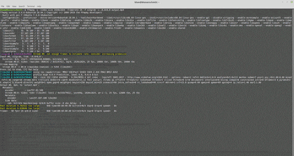

# AngularCoronaDashboard

AngularCoronaDashboard is a dashboard showing global trends in the ongoing COVID-19 pandemic.

## Demo

## Live Demo

## Dependencies
@angular/cdk@^9.2.4
@angular/material@^9.2.4

## Development server

Run `ng serve` for a dev server. Navigate to `http://localhost:4200/`. The app will automatically reload if you change any of the source files.

## Build

Run `ng build` to build the project. The build artifacts will be stored in the `dist/` directory. Use the `--prod` flag for a production build.

## License

GPL v3
